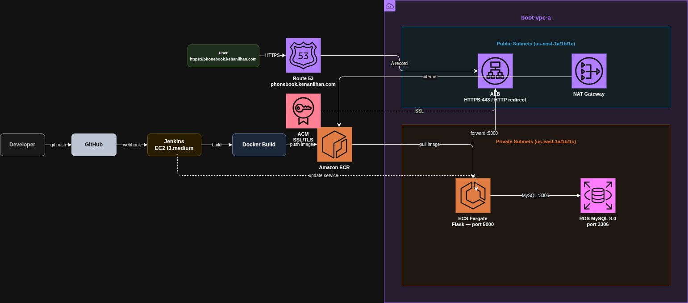

# 📞 Flask Phonebook App on AWS ECS Fargate


A production-grade CI/CD pipeline and cloud infrastructure for a Flask + MySQL phonebook application, fully automated with Terraform and Jenkins. The application runs on **AWS ECS Fargate** with **RDS MySQL**, served over HTTPS via **ACM + ALB + Route53**.

---

## 📸 Application

> `https://phonebook.kenanilhan.com`



---

## 🏗️ Architecture

```
Developer → GitHub → Jenkins (EC2) → Docker Build → ECR → ECS Fargate
                                                              ↕
User → Route53 → ALB (HTTPS) → ECS Fargate (Flask) → RDS MySQL
```

- **CI/CD:** GitHub webhook triggers Jenkins pipeline on every push
- **Build:** Docker image is built on Jenkins EC2 and pushed to ECR
- **Deploy:** ECS service is updated with `force-new-deployment`
- **Network:** Flask containers run in **private subnets**, only ALB is public-facing
- **Database:** RDS MySQL in private subnet, accessible only from ECS security group
- **HTTPS:** ACM certificate with DNS validation via Route53

---

## 🛠️ Technologies

| Tool / Service | Purpose |
|---|---|
| **Amazon ECS Fargate** | Serverless container runtime |
| **Amazon RDS MySQL 8.0** | Managed relational database |
| **Amazon ECR** | Container image registry |
| **Application Load Balancer** | HTTPS traffic routing |
| **AWS Certificate Manager** | Free SSL/TLS certificate |
| **Route53** | DNS management |
| **NAT Gateway** | Private subnet internet access for ECR pulls |
| **Jenkins** | CI/CD automation server |
| **Terraform** | Infrastructure as Code |
| **Docker** | Containerization |
| **GitHub** | Source control + webhook trigger |
| **Amazon S3** | Remote Terraform state backend |

---

## 📁 Project Structure

```
ecs-fargate-phonebook/
├── phonebook-app.py              # Flask application
├── requirements.txt              # Python dependencies
├── Dockerfile                    # Container image definition
├── docker-compose.yaml           # Local development setup
├── Jenkinsfile                   # CI/CD pipeline definition
├── templates/
│   ├── index.html                # Search page
│   ├── add-update.html           # Add/Update page
│   └── delete.html               # Delete page
├── terraform/
│   ├── jenkins-server/           # Jenkins EC2 infrastructure
│   │   ├── main.tf               # EC2, SG, EIP, IAM Role
│   │   ├── variables.tf
│   │   └── scripts/
│   │       └── jenkins-setup.sh  # Java, Jenkins, Docker, Git, AWS CLI
│   └── infra/                    # Application infrastructure
│       ├── main.tf               # Provider, backend, data sources
│       ├── variables.tf
│       ├── terraform.tfvars      # ⚠️ Not committed — see below
│       ├── security_groups.tf    # ALB, ECS, RDS security groups
│       ├── ecr.tf                # ECR repo + null_resource image push
│       ├── rds.tf                # RDS MySQL instance + subnet group
│       ├── alb.tf                # ALB, target group, HTTP/HTTPS listeners
│       ├── ecs.tf                # ECS cluster, task definition, service, NAT GW
│       ├── acm.tf                # SSL certificate + DNS validation
│       └── route53.tf            # A record → ALB
└── docs/
    ├── architecture.png
    ├── architecture.xml          # draw.io editable diagram
    └── screenshots/
```

---

## 📋 Table of Contents

1. [Prerequisites](#1-prerequisites)
2. [S3 Backend Setup](#2-s3-backend-setup)
3. [Jenkins Server Setup](#3-jenkins-server-setup)
4. [IAM Role for Jenkins](#4-iam-role-for-jenkins)
5. [Application Infrastructure](#5-application-infrastructure)
6. [Configure terraform.tfvars](#6-configure-terraformtfvars)
7. [Jenkins Pipeline Setup](#7-jenkins-pipeline-setup)
8. [GitHub Webhook](#8-github-webhook)
9. [Cleanup](#9-cleanup)
10. [Key Notes](#-key-notes)

---

## 1. Prerequisites

- AWS CLI configured (`aws configure`)
- Terraform >= 1.5.0
- Docker installed locally
- Route53 hosted zone for your domain

---

## 2. S3 Backend Setup

Terraform state is stored remotely in S3 with encryption and locking. Create the bucket manually **before** running Terraform:

```bash
# Create S3 bucket
aws s3api create-bucket --bucket kenan-phonebook-tf-state-2026 --region us-east-1

# Enable encryption
aws s3api put-bucket-encryption --bucket kenan-phonebook-tf-state-2026 \
  --server-side-encryption-configuration \
  '{"Rules":[{"ApplyServerSideEncryptionByDefault":{"SSEAlgorithm":"AES256"}}]}'

# Enable versioning
aws s3api put-bucket-versioning --bucket kenan-phonebook-tf-state-2026 \
  --versioning-configuration Status=Enabled
```

> ⚠️ S3 native locking is used (`use_lockfile = true`) instead of DynamoDB — requires AWS provider >= 6.0

Both Jenkins and app infrastructure share the same bucket with separate state keys:
- `jenkins/terraform.tfstate`
- `app/terraform.tfstate`

---

## 3. Jenkins Server Setup

```bash
cd terraform/jenkins-server
terraform init
terraform apply
```

This creates:
- EC2 `t3.medium` with 20GB gp3 EBS
- Security Group (ports 22, 80, 8080)
- Elastic IP
- IAM Role with ECR + ECS permissions (attached at creation)
- `user_data` script installs: Java 17, Jenkins, Docker, Git, AWS CLI

Get the Jenkins URL from Terraform output:
```bash
terraform output jenkins_url
# http://<ELASTIC_IP>:8080
```

---

## 4. IAM Role for Jenkins

The Jenkins EC2 instance uses an **IAM Role** instead of static credentials — no `aws configure` needed. The role (`jenkins-ec2-role`) is created by Terraform and attached to the EC2 instance at launch via instance profile.

Permissions granted:
- `ecr:GetAuthorizationToken`, `ecr:PutImage`, `ecr:BatchCheckLayerAvailability` — push images
- `ecs:UpdateService`, `ecs:RegisterTaskDefinition`, `ecs:DescribeServices` — deploy to ECS

> ⚠️ If you destroy and recreate the Jenkins EC2, the IAM Role is automatically re-attached because it's defined in Terraform. No manual association needed.

---

## 5. Application Infrastructure

```bash
cd terraform/infra
terraform init
terraform apply
```

This creates (in dependency order):
1. ECR repository + initial Docker image push (`null_resource`)
2. VPC security groups (ALB → ECS → RDS, layered)
3. RDS MySQL 8.0 in private subnets
4. ACM certificate with Route53 DNS validation
5. ALB with HTTPS listener + HTTP → HTTPS redirect
6. NAT Gateway in public subnet (enables private ECS tasks to pull from ECR)
7. ECS Cluster, Task Definition, Fargate Service

> ⚠️ The `null_resource` in `ecr.tf` runs `docker build` and `docker push` locally on first `terraform apply`. This requires Docker to be running on your machine and AWS credentials available.

---

## 6. Configure terraform.tfvars

Create `terraform/infra/terraform.tfvars` — this file is in `.gitignore` and must **never** be committed:

```hcl
vpc_id = "vpc-xxxxxxxxxxxxxxxxx"

public_subnet_ids = [
  "subnet-xxxxxxxxxxxxxxxxx",   # us-east-1a
  "subnet-xxxxxxxxxxxxxxxxx",   # us-east-1b
  "subnet-xxxxxxxxxxxxxxxxx"    # us-east-1c
]

private_subnet_ids = [
  "subnet-xxxxxxxxxxxxxxxxx",   # us-east-1a
  "subnet-xxxxxxxxxxxxxxxxx",   # us-east-1b
  "subnet-xxxxxxxxxxxxxxxxx"    # us-east-1c
]

app_name          = "phonebook"
environment       = "dev"

# ECS
flask_image_uri   = "<ACCOUNT_ID>.dkr.ecr.us-east-1.amazonaws.com/phonebook-flask:latest"
flask_cpu         = 256
flask_memory      = 512

# RDS
db_name           = "phonebook_db"
db_username       = "admin"
db_password       = "your-secure-password"
db_instance_class = "db.t3.micro"
```

> ℹ️ AWS Account ID and region are never hardcoded in `.tf` files — they are retrieved dynamically via `data "aws_caller_identity"` and provider configuration.

---

## 7. Jenkins Pipeline Setup

1. Open Jenkins at `http://<ELASTIC_IP>:8080`
2. Install **GitHub Integration Plugin** (Manage Jenkins → Plugins)
3. New Item → Pipeline → Configure:
   - **GitHub project URL:** `https://github.com/ekilhan/ecs-fargate-phonebook`
   - **Build Triggers:** GitHub hook trigger for GITScm polling
   - **Pipeline:** Pipeline script from SCM → Git
   - **Branch:** `*/main`
   - **Script Path:** `Jenkinsfile`

### Pipeline Stages

```
Checkout → Build Docker Image → Push to ECR → Deploy to ECS
```

The `Jenkinsfile` uses IAM Role credentials automatically — no Jenkins credentials configuration needed.

---

## 8. GitHub Webhook

GitHub → Repository → Settings → Webhooks → Add webhook:

- **Payload URL:** `http://<JENKINS_IP>:8080/github-webhook/`
- **Content type:** `application/json`
- **Events:** Just the push event

> ⚠️ Jenkins EC2 gets a new Elastic IP on every `terraform apply`. Update the webhook URL after each infrastructure recreation.

---

## 9. Cleanup

```bash
# Destroy application infrastructure (ECR force_delete=true removes images too)
cd terraform/infra
terraform destroy

# Destroy Jenkins server
cd terraform/jenkins-server
terraform destroy
```

> ⚠️ Most expensive resources running per hour: **NAT Gateway** (~$0.045/hr), **RDS** (~$0.017/hr), **ALB** (~$0.008/hr). Always destroy when not in use.

---

## 🔑 Key Notes

**Security Groups — layered access:**
- ALB SG: accepts 80, 443 from `0.0.0.0/0`
- ECS SG: accepts 5000 **only from ALB SG**
- RDS SG: accepts 3306 **only from ECS SG**

**Private Subnets + NAT Gateway:**
ECS tasks run in private subnets with no public IP. NAT Gateway in the public subnet allows them to pull Docker images from ECR and reach CloudWatch Logs.

**Database Initialization:**
The Flask app uses `@app.before_request` to run `CREATE TABLE IF NOT EXISTS` on every request startup. This means the table is automatically created on first use — no manual SQL execution needed after infrastructure setup.

**State Locking:**
S3 native locking (`use_lockfile = true`) prevents concurrent `terraform apply` runs from corrupting state. Requires AWS provider `~> 6.0`.

**No Hardcoded Credentials:**
- Jenkins uses EC2 IAM Role (no `aws configure`)
- Terraform uses `data "aws_caller_identity"` for account ID
- Sensitive values live only in `terraform.tfvars` (gitignored)

---

## 💰 Estimated Cost

| Service | Pricing |
|---|---|
| ECS Fargate (256 CPU / 512 MB) | ~$0.011/hour |
| RDS MySQL db.t3.micro | ~$0.017/hour |
| ALB | ~$0.008/hour + data transfer |
| NAT Gateway | ~$0.045/hour + data transfer |
| EC2 t3.medium (Jenkins) | ~$0.0416/hour |
| Route53 | $0.50/month per hosted zone |
| ACM | Free |
| ECR | First 500MB free |

> ⚠️ Always destroy resources after testing to avoid unexpected charges.

---

## 👤 Author

### Current Issues
- Add / Update / Delete pages are not linked from the main search page — navigation buttons need to be added to `index.html`
- Sample data (`init.sql`) is not automatically seeded into RDS on first deploy — manual insertion or a seeding mechanism is needed

**Erhan Kenan İlhan**  
[GitHub](https://github.com/ekilhan) · [LinkedIn](https://linkedin.com/in/erhankenanilhan)
